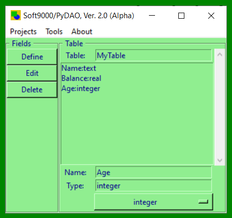

# PyDAO 9000
The Soft9000/PyDAO ("__PyDAO 9000__") Project allows us to quickly create a Python Class from either a GUI, API, textual (CSV, TDF, Enpiped, etc.) data file, or using a Python Dictionary. 

Best of all the code generated by __PyDAO 9000__ is 100% Core Python 3 - no other files are required!


_Workflows include_: 

(1) Creating stand-alone __PyDAO 9000__ DAO script(s.) 

(2) Extracting __PyDAO 9000__ projects from textual (CSV, etc.) data files, 

(3) Creating database code from __PyDAO 9000__ projects, and 

(4) Directly creating code from the __PyDAO 9000__ API. Result output-locations can also be specified.

The generated code can be used to create / drop database schema (DDL,) as well as to import & work with (C.R.U.D & query) your designed / detected / updated projects.

All four (4) workflows are supported - feel free to give each a try!


The GUI
-------


Years latter the project is working well enough to declare what we have as an [Official PyPi Package](https://pypi.org/project/PyDAO-9000/).

Once installed most will probably want to use the GUI:

```
>>> from SqltDAO import main as PyDAO
>>> PyDAO.Main.mainloop()
```

As of this release, the GUI will also now start when importing SqltDAO:

```
>>> import SqltDAO.MainGUI
```

If you want to support the effort feel free to purchase one of [our books on amazon](https://www.amazon.com/Randall-Nagy/e/B08ZJLH1VN) or [training opportunuties](https://www.udemy.com/user/randallnagy2/).

PyDAO UI: https://github.com/soft9000/PyDAO/blob/master/SqltDAO/main.py


API Example
------------
For those who would rather create the DAO directly without needing a file full of data:

Fast-Schema Example - https://github.com/soft9000/PyDAO/blob/master/SqltDAO/Demo123.py


DATA EXAMPLE + TEST CASE
------------------------
Includes a classic "address book" example as a test case:

Data Example: https://github.com/soft9000/PyDAO/blob/master/SqltDAO/DaoTest01/tc001_data.txt

Generated Code: https://github.com/soft9000/PyDAO/blob/master/SqltDAO/DaoTest01/foo.py


STOCK MARKET
------------
Python 1000, Python 2000, and Python 3000 students who are participating in our Stock Market resume-builder will want 
to look at the [NASDAQ database generator](https://github.com/soft9000/PyDAO/blob/master/SqltDAO/DaoTest01/GenNasdaqTest.py).

While that stock exchange's official pipe-delimited ("enpiped" ;) data file is incuded for demonstrative
purposes, note that the most recent set of enpiped data tokens can be downloaded from the stock exchange.


VIDEO TRAINING
--------------
If you need to learn Python 3, then consider:

https://www.udemy.com/python-1000

https://www.udemy.com/python-2000-beyond-the-basics

https://www.udemy.com/python-2100-objects-factories-frameworks


As well as our "Python 3000 SQL Quick Start:" https://www.udemy.com/python-3000-tactical-sql-quick-start


PyQuest Activity
----------------
Need some practice? Then try to ...


WORKS IN PROGRESS
------------
[WIP] GenTUI: Rapidly create a textual / console data CRUD application.

[WIP] GenGUI: Rapidly create a graphical / GUI CRUD application.

## zSupport?
If you want to support the effort, I seek no donations. Instead, simply feel free to purchase one of [my educational](https://www.udemy.com/user/randallnagy2/) or [printed](https://www.amazon.com/Randall-Nagy/e/B08ZJLH1VN?ref=sr_ntt_srch_lnk_1&qid=1660050704&sr=8-1) productions?
